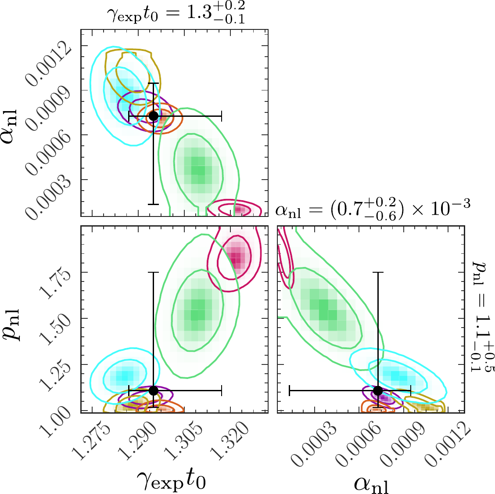

# Paper Analysis Pipeline

This repository contains the analysis scripts, simulation inputs, summary datasets, and final figures that support the following published paper.

| | |
|---|---|
| Title | `The growth of magnetic energy during the nonlinear phase of the subsonic and supersonic small-scale dynamo` |
| Authors | Neco Kriel, James R. Beattie, Mark R. Krumholz, Jennifer Schober, Patrick J. Armstrong |
| Journal | `Physical Review E` |
| Published | `2026-04-27` |
| DOI | [`10.1103/8qjf-8gg4`](https://journals.aps.org/pre/abstract/10.1103/8qjf-8gg4) |
| arXiv | [`2509.09949`](https://arxiv.org/abs/2509.09949) |
| Summary | [gist.science](https://gist.science/paper/2509.09949?na=1) |

### Abstract

Small-scale dynamos (SSDs) amplify magnetic fields in turbulent plasmas. Theory predicts nonlinear magnetic energy growth $E_\mathrm{mag} \propto t^{p_\mathrm{nl}}$, but this scaling has not been tested across flow regimes. Using a large ensemble of SSD simulations spanning subsonic to supersonic turbulence, we measure linear growth ($p_\mathrm{nl} = 1$) in subsonic flows and quadratic growth ($p_\mathrm{nl} = 2$) in supersonic flows. In all cases, the nonlinear dynamo converts a nearly constant fraction $\sim 1/100$ of the turbulent kinetic energy flux into magnetic energy, and the nonlinear phase has a characteristic duration $\Delta t \approx 20\,t_0$, where $t_0$ is the outer-scale turnover time. By isolating the onset of magnetic backreaction in SSDs, our statistical ensemble approach identifies a robust efficiency and duration for the nonlinear SSD that can be used to interpret more complex astrophysical and laboratory plasmas.

### Posterior Aggregation

Joint posterior distributions for important nonlinear SSD growth, shown for six independent realizations of the same simulation setup. Each individual-realization is a different color, with the aggregated posterior shown as a black point; together they highlight the hierarchical Bayesian treatment applied across simulation ensembles.

<div align="center">
  
</div>

---

## Getting Setup

The project uses `uv` for dependency management.

```bash
uv sync
```

Run scripts through `uv` from the repository root:

```bash
uv run python <path/to/script.py>
```

---

## Data Products

> **Note:** A "suite" is the set of simulation instances with the same plasma parameters (`Re`, `Pm`, `Mach`) and grid resolution. Suite-level statistics are aggregated over those instances.

| Path | Contents |
|---|---|
| `datasets/sims/` | Input to pipeline: simulation parameters and raw time series for each simulation instance |
| `datasets/suite_fit_posteriors.json` | Produced by the pipeline: MCMC posterior percentiles aggregated from fits to all simulation instances in a suite |
| `datasets/suite_scalings.json` | Produced by the pipeline: growth-rate scalings derived from the aggregated MCMC fit posteriors |
| `figures/` | Produced by the pipeline: final paper figures |

The JSON files storing suite-level results are tracked, but rerunning the pipeline will overwrite them. Before rerunning the pipeline, keep the local regenerated copies out of `git status` with:

```bash
git update-index --skip-worktree datasets/suite_fit_posteriors.json datasets/suite_scalings.json
```

---

## Scripts

These are the main scripts for rerunning the analysis pipeline.

| Script | Purpose |
|---|---|
| `scripts/fit_posteriors/fit_with_mcmc.py` | Run one MCMC fit for a simulation instance and nonlinear-phase model |
| `scripts/fit_posteriors/fit_all_sims.py` | Run missing MCMC fits locally |
| `scripts/aggregate_stats/extract_mcmc_stats.py` | Rebuild `datasets/suite_fit_posteriors.json` from saved MCMC samples |
| `scripts/aggregate_stats/print_summary_table.py` | Print the LaTeX table rows from `datasets/suite_scalings.json` |
| `scripts/plot_results/plot_gamma_exp_scaling.py` | Generate `figures/gamma_exp_scaling.pdf` |
| `scripts/plot_results/plot_nl_exponent.py` | Generate `figures/nl_exponent.pdf` |
| `scripts/plot_results/plot_nl_scalings.py` | Generate `figures/nl_scalings.pdf` |
| `scripts/plot_results/plot_time_evolution.py` | Generate `figures/time_evolution.pdf` |

The single-fit command has the form:

```bash
uv run python scripts/fit_posteriors/fit_with_mcmc.py \
  --data-directory datasets/sims/<simulation-directory> \
  --model <free|linear|quadratic> \
  [--num-bins <number>] \
  [--no-progress]
```

Internal helper modules live under `scripts/fit_posteriors/mcmc_routines/` and `scripts/plot_results/`.

---

## File Structure

```text
kriel-2026-ssd-nonlinear/
├── datasets/
│   ├── sims/
│   ├── suite_fit_posteriors.json
│   └── suite_scalings.json
├── figures/
│   ├── gamma_exp_scaling.pdf
│   ├── nl_exponent.pdf
│   ├── nl_scalings.pdf
│   └── time_evolution.pdf
├── scripts/
│   ├── aggregate_stats/
│   ├── fit_posteriors/
│   └── plot_results/
├── pyproject.toml
├── uv.lock
└── README.md
```

---

## License

See [LICENSE](./LICENSE).
